# R Language

R is a free software programming language and a software environment for statistical computing and graphics.

## Reference

* [Try R on CodeSchool](http://tryr.codeschool.com/)

## Install on Mac with home-brew

```
$ brew install gfortran R
```

## Basic

```
> T == TRUE
[1] TRUE

> x <- T
[1] TRUE

> sum(1,3,5)
[1] 9

> rep("Yo ho!",­ times­ = 3)
[1] "Yo ho!" "Yo ho!" "Yo ho!"

> help(sum)
> example(min)
> list.files() // list the files in the current directory
```

---

## Run script

```
> source("bottle1.R") // Run "bottle1.R" script
```

---
## Vectors 

( c is short for Combine ) creates a new vector by combining a list of values.

```
> c(4, 7, 9)
```

Vectors cannot hold values with different modes (types). All the values were converted to a single mode (characters) so that the vector can hold them all.

```
> c(1, T, "Three")
[1] "1" "TRUE" "Three"
```

### Sequence Vectors

```
> 5:9
[1] 5 6 7 8 9

> seq(5, 9)
[1] 5 6 7 8 9

> seq(5, 9, 0.5)
[1] 5.0 5.5 6.0 6.5 7.0 7.5 8.0 8.5 9.0

> sentence <- c('walk', 'the', 'plank')
> sentence[1] // R's vector indices start at 1.
[1] "walk"
> sentence[3] <- "dog"
> sentence[4] <- "to"
> sentence[5­:7] <- c('th­e', 'poop­', 'deck­')
> sentence[c(1,3)]
[1] "walk" "dog"

> sentence[2:4]
[1] "the" "dog" "to"
```

### Vetcor Names

**names()** Functions to get or set the names of an object.

```
> ranks <- 1:3
> names(ranks) <- c("first", "second", "third")
> ranks
first second third
    1      2     3

> ranks[1]
first
    1

> ranks["first"]
first
    1

> ranks["third"] = 5
> ranks["third"]
third
    5
```

### Plotting One Vector

**barplot()** function draws a bar chart with a vector's values.

```
> vesselsSunk <- c(4, 5, 1)
> barplot(vesselsSunk)
```
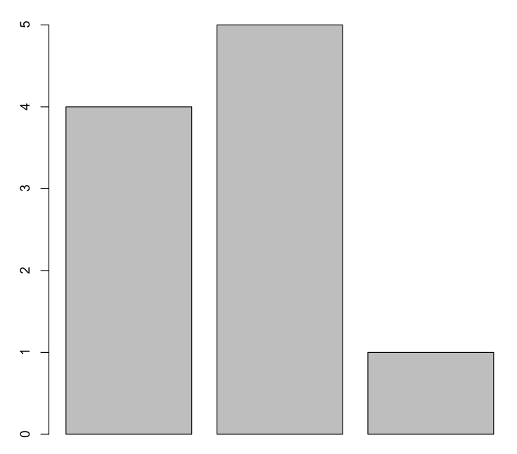

```
> names(vesselsSunk) <- c("England", "France", "Norway")
> barplot(vesselsSunk)
```
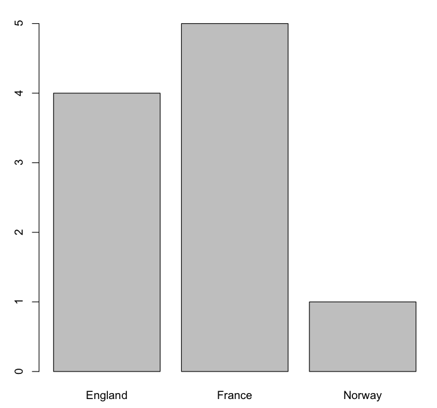

```
> barplot(1:100)
```


### Vector Math

```
> a <- c(1, 2, 3)
> a + 1
[1] 2 3 4

> a*2
[1] 2 4 6

> a == c(1, 8, 3)
[1] TRUE FALSE TRUE

> a > c(1, 1, 1)
[1] FALSE TRUE TRUE

> b <- c(2, 3, 4)
> a+b
[1] 3 5 7

> c <- c(2, 3, 4, 5, 6, 7)
> a+c
[1] 3 5 7 6 8 10

> sin(a)
[1] 0.8414710 0.9092974 0.1411200

> sqrt(a)
[1] 1.000000 1.414214 1.732051
```

### Scatter Plots

The **plot()** function takes two vectors, one for X values and one for Y values, and draws a graph of them.

```
> x <- seq(1, 20, 0.1)
> y <- sin(x)
> plot(x, y)
```
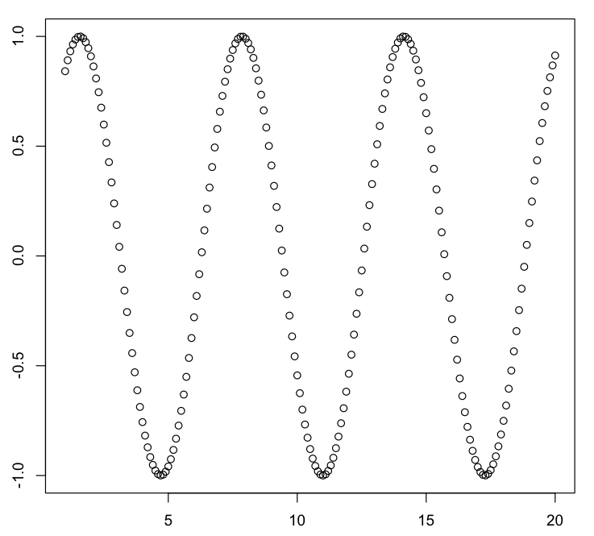

```
> values <- -10:10
> absolutes <- abs(values)
> plot(values, absolutes)
```
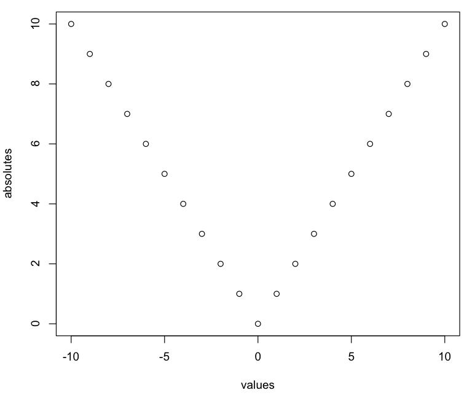

### NA VAlues

```
> a <- c(1, 3, NA, 7, 9)
> sum(a)
[1] NA

> sum(a, na.rm = TRUE)
[1] 20
```

## Matrices

```
> matrix(0, 3, 4)
     [,1] [,2] [,3] [,4]
[1,]    0    0    0    0
[2,]    0    0    0    0
[3,]    0    0    0    0

> a<-1:12
> matrix(a, 3, 4)
     [,1] [,2] [,3] [,4]
[1,]    1    4    7   10
[2,]    2    5    8   11
[3,]    3    6    9   12
```
The **dim()** assignment function sets dimensions for a matrix. It accepts a vector with the number of rows and the number of columns to assign.

```
> plank <- 1:8
> dim(plank) <- c(2,4)
> plank
     [,1] [,2] [,3] [,4]
[1,]    1    3    5    7
[2,]    2    4    6    8

> plank[2:3]
[1] 6

> plank[2,]
[1] 2 4 6 8

> plank[, 2:4]
     [,1] [,2] [,3]
[1,]    3    5    7
[2,]    4    6    8
```


### Matrix Plotting

```
> elevation <- matrix(1, 10, 10)
> elevation[4,6] <- 0
> contour(elevation)
```
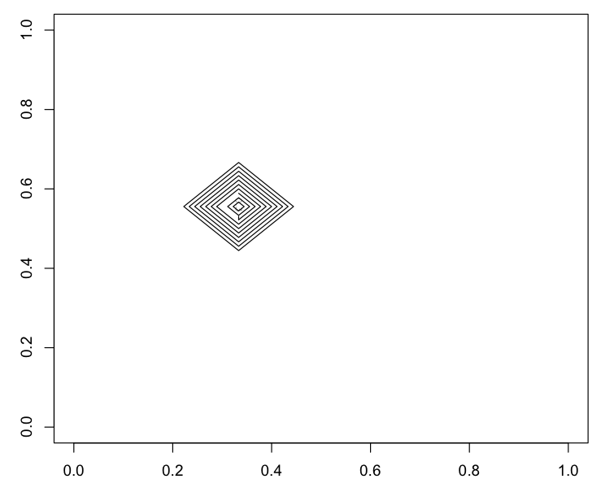

```
> persp(elevation)> 
```
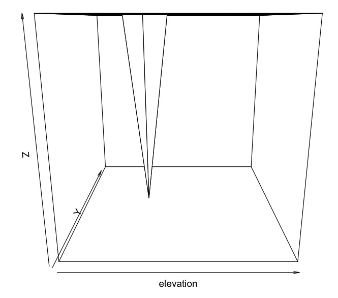

```
> persp(elevation, expand=0.2)
```
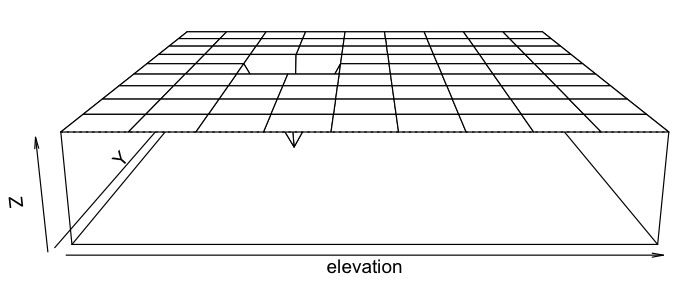

```
> contour(volcano)
```
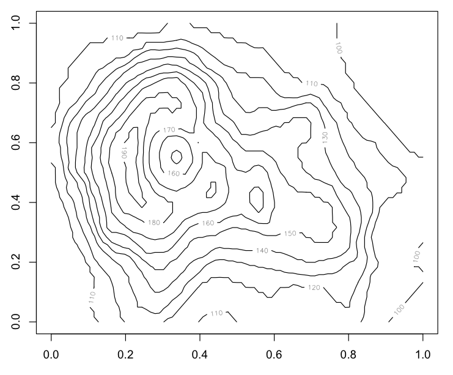

```
> persp(volcano, expand=0.2)
```
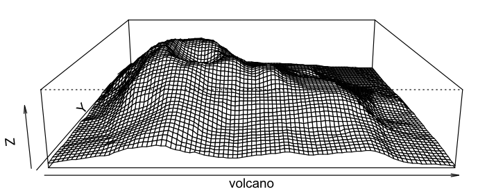

```
> image(volcano)
```
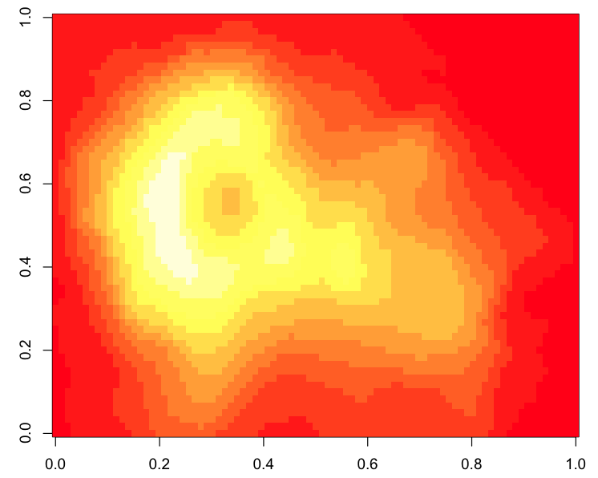


## Summary Statistics

### Mean
```
> limbs <- c(4, 3, 4, 3, 2, 4, 4, 4)
> names(limbs) <- c('One-Eye', 'Peg-Leg', 'Smitty', 'Hook', 'Scooter', 'Dan', 'Mikey', 'Blackbeard')
> mean(limbs)
[1] 3.5

> barplot(limbs)
```
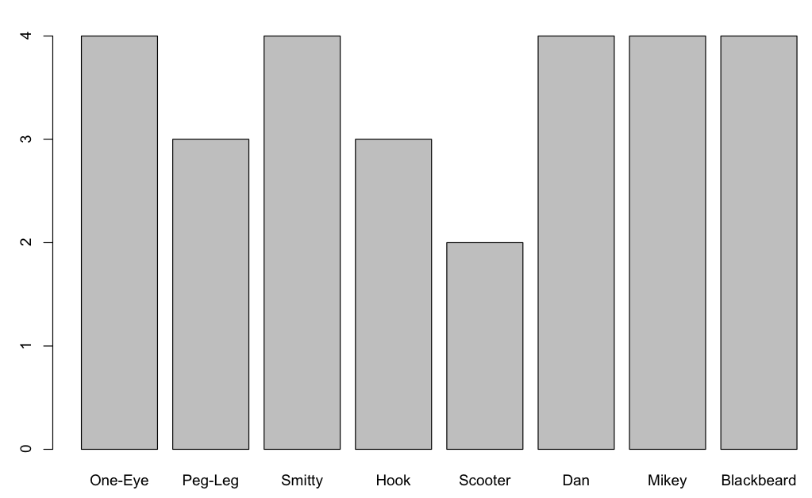

```
> abline(h = mean(limbs))
```
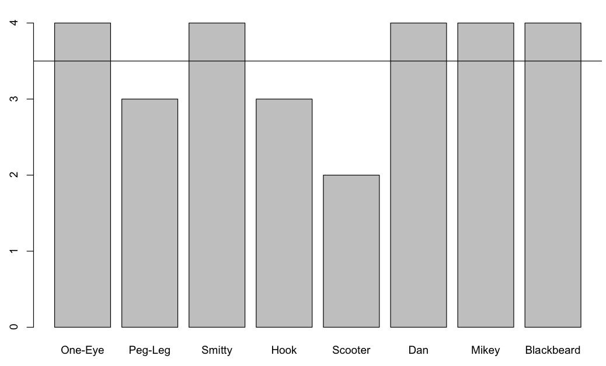

### Median
```
> limbs <- c(4, 3, 4, 3, 2, 4, 4, 14)
> names(limbs) <- c('One-Eye', 'Peg-Leg', 'Smitty', 'Hook', 'Scooter', 'Dan', 'Mikey', 'Davy Jones')
> mean(limbs)
[1] 4.75

> barplot(limbs)
> abline(h = mean(limbs))
```


```
> median(limbs)
[1] 4

> barplot(limbs)
> abline(h = median(limbs))
```
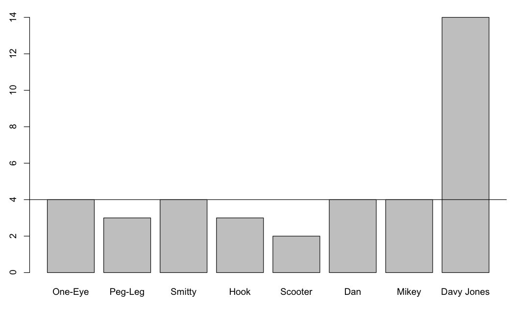


### Standard Deviation

```
> pounds <- c(45000, 50000, 35000, 40000, 35000, 45000, 10000, 15000)
> barplot(pounds)
> meanValue <- mean(pounds)
> deviation <- sd(pounds)
> abline(h = meanValue)
> abline(h = meanValue + deviation)
> abline(h = meanValue - deviation)
```
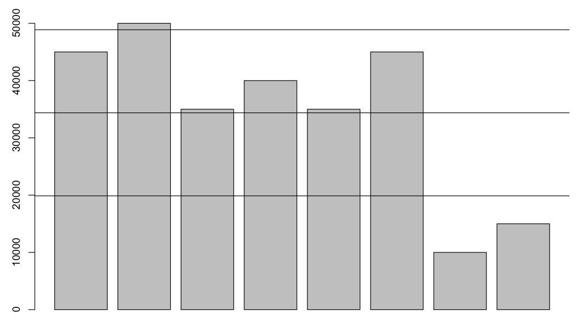

---
## Factors

```
> chests <- c('gold', 'silver', 'gems', 'gold', 'gems')
> print(chests)
[1] "gold"   "silver" "gems"   "gold"   "gems" 

> types <- factor(chests)
> print(types)
[1] gold   silver gems   gold   gems  
Levels: gems gold silver

> as.integer(types)
[1] 2 3 1 2 1

> levels(types)
[1] "gems"  "gold"  "silver"
```

### Plots With Factors

```
> weights <- c(300, 200, 100, 250, 150)
> prices <- c(9000, 5000, 12000, 7500, 18000)
> plot(weights, prices)
```

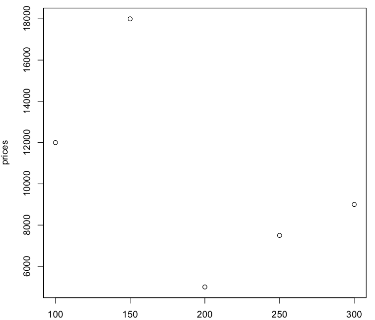


```
> plot(weights, prices, pch=as.integer(types))
```
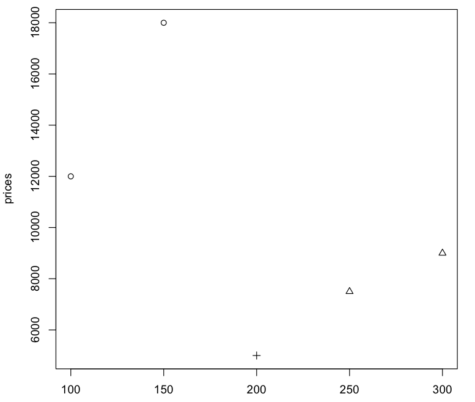

```
> legend("topright", c("gems", "gold", "silver"), pch=1:3)
```
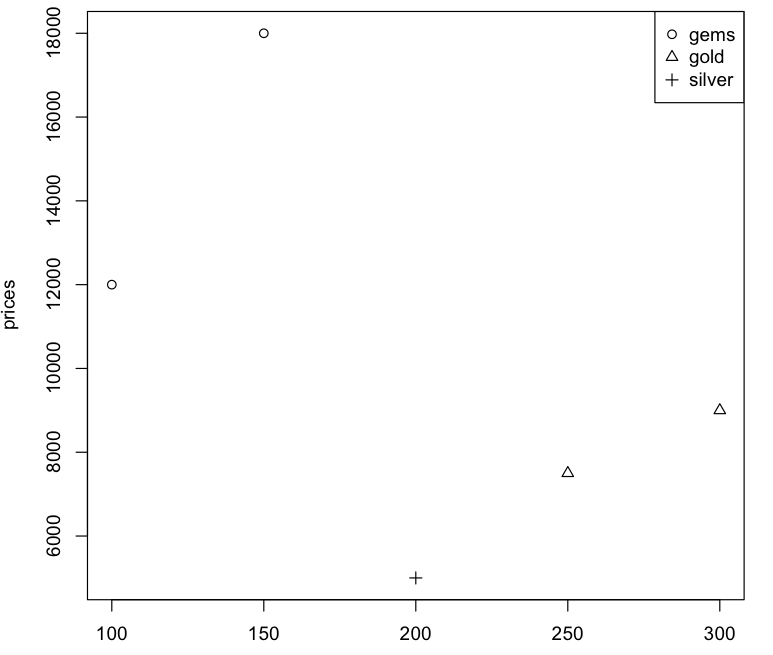

```
> legend("topright", levels(types), pch=1:length(levels(types)))
```
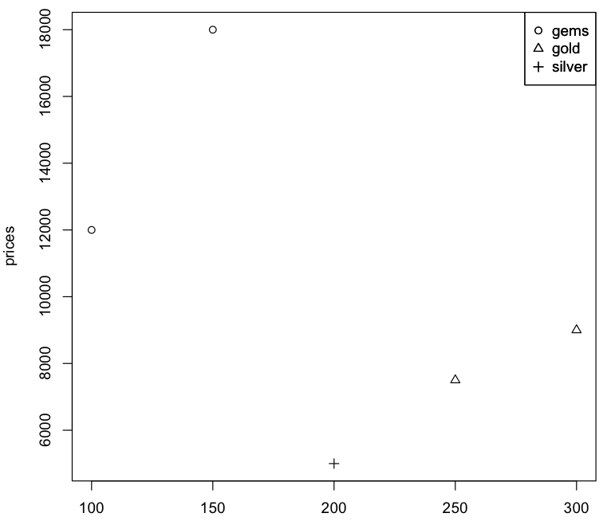


